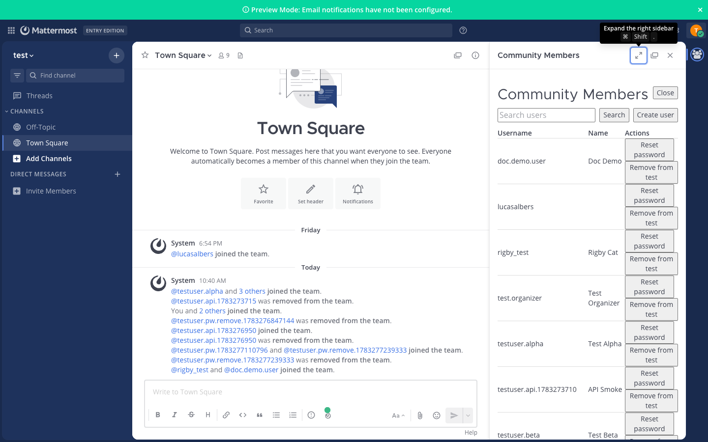

# Community Admin for Mattermost

[](https://github.com/lucas-albers-lz4/mattermost-plugin-community-admin/actions/workflows/ci.yml)
[](LICENSE)

Delegated user management for **invite-only Mattermost communities**. System administrators configure trusted organizers; organizers create members, reset passwords, and manage team membership within assigned scope — without email invites or full system-admin access.

**Plugin ID:** `com.lalbers.community-admin`  \
**License:** Apache 2.0  \
**Status:** Community-maintained (not affiliated with Mattermost, Inc.)

> **Note on naming:** The plugin ID `com.lalbers.community-admin` is the install/upgrade key in Mattermost's plugin registry. It remains `lalbers` because changing it would orphan existing installations. The repository moved to `github.com/lucas-albers-lz4` — all documentation links use the new URL.

---

## Who is this for?

| Audience | Use case |
|----------|----------|
| Community operators | Youth sports, clubs, classes — admins delegate roster management to coaches |
| Small Team Edition deployments | No LDAP; need controlled local-user provisioning |
| Invite-only workspaces | Members receive credentials out-of-band; no self-signup |

## Features



- **Scoped organizers** — allowlist by user ID with per-team/channel permissions
- **Create users** — username + password, optional team/channel assignment, credential handoff text
- **Reset passwords** — server-generated passwords with copy-paste handoff banner
- **Manage membership** — add/remove users from teams and channels in scope
- **Audit log** — mutating actions recorded (passwords never stored)
- **Mobile fallback** — `/community-admin` slash commands when the webapp panel is unavailable

## Requirements

| Requirement | Notes |
|-------------|-------|
| Mattermost **6.2.1+** | Tested on 11.8.x Team / Entry Edition |
| **Plugins enabled** | System Console → Plugins → Plugin Management |
| **`EnableLocalMode: true`** | Required for admin password reset via `mmctl --local` inside the container |
| **System admin** | Installs plugin and configures organizer scope |

## Installation

### Option A — Release tarball (recommended)

1. Download the latest `com.lalbers.community-admin-*.tar.gz` from [Releases](https://github.com/lucas-albers-lz4/mattermost-plugin-community-admin/releases).
2. Verify checksum against `SHA256SUMS` in the release assets.
3. Upload and enable:

```sh
mmctl plugin add com.lalbers.community-admin-<version>.tar.gz
mmctl plugin enable com.lalbers.community-admin
```

Or use **System Console → Plugins → Plugin Management → Upload**.

### Option B — Build from source

```sh
git clone https://github.com/lucas-albers-lz4/mattermost-plugin-community-admin.git
cd mattermost-plugin-community-admin
make dist
mmctl plugin add dist/com.lalbers.community-admin-*.tar.gz
mmctl plugin enable com.lalbers.community-admin
```

## Configuration

1. Open **System Console → Plugins → Community Admin**.
2. Set **Site URL** (appears in credential handoff messages).
3. Add organizers by username; assign teams and optional channels.
4. Click **Save**.

Organizers open **Community Members** from the channel header (desktop/web) or use slash commands on mobile. See the [user guide](docs/user-guide.md).

```json
{
  "version": 1,
  "site_url": "https://chat.example.org",
  "email_domain": "community.local",
  "organizers": [
    {
      "user_id": "<mattermost-user-id>",
      "display_username": "coach.smith",
      "teams": [{"id": "<team-id>", "name": "U12 Soccer"}],
      "channels": [],
      "all_channels_in_teams": ["<team-id>"]
    }
  ]
}
```

Full reference: [docs/configuration.md](docs/configuration.md)

## Documentation

| Audience | Start here |
|----------|------------|
| **Organizers** | [User guide](docs/user-guide.md) — panel, slash commands, credential handoff |
| **Operators / admins** | [Configuration](docs/configuration.md) — scope editor, JSON schema |
| **Operators / devs** | [Operations](docs/operations.md) — deploy, upgrade, troubleshooting |
| **Developers** | [Design](docs/design.md) — architecture, API, authz |
| **Developers** | [Testing](docs/testing.md) — API smoke, Playwright e2e, manual checklist |
| **Everyone** | [FAQ](docs/FAQ.md) — common questions and answers |

See [docs/README.md](docs/README.md) for the full documentation index.

## Development

```sh
go test ./...
cd webapp && npm install && npm run build
make dist
make install-dev-tools && make setup-hooks   # optional: pre-commit hooks
```

Contributing: [CONTRIBUTING.md](CONTRIBUTING.md) · Changes: [CHANGELOG.md](CHANGELOG.md)

## Limitations (MVP)

- Password reset requires `mmctl --local` (local socket mode) on the Mattermost server
- Not published on the official Mattermost Marketplace (install via release tarball)
- Plugin webapp does not run on mobile clients (slash commands provided instead)
- On Mattermost 11 Entry Edition, use the **channel header** button if the product menu omits plugin items

## License

Apache License 2.0. See [LICENSE](LICENSE). Derived from the [Mattermost plugin starter template](https://github.com/mattermost/mattermost-plugin-starter-template).
